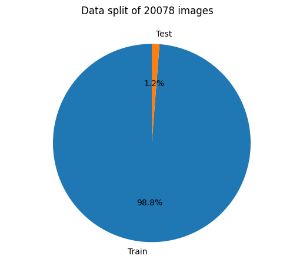
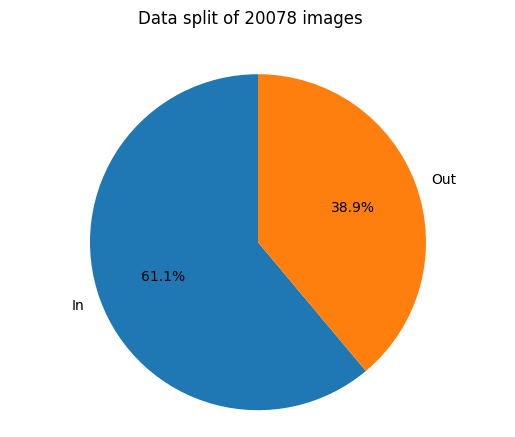

# Introduction

This is a small project using Pépito the Cat data [Twitter account](https://x.com/PepitoTheCat). This Twitter bot is linked to a Raspberry Pi and a camera. The camera takes a picture of a cat trapdoor every time Pépito the Cat goes in or out. The picture is then posted on Twitter with a message (in our out).

There are two types of data:
- The pictures for classification
- The timeseries data of the cat going in and out

The goal of this project is to classify the pictures of the cat trapdoor to know if Pépito the Cat is going in or out. This will be done using a Convolutional Neural Network (CNN).
The timeseries data could be used to predict when Pépito the Cat will go in or out, or to analyze his behavior.

# Data

The image dataset is available [here](https://huggingface.co/datasets/PepitoTheCat2007/pepito-images). It is presplitted into a training and a testing set.



The classes are:
- 0: In
- 1: Out

The repartition of the classes is supposedly balanced. The real repartition is the following:


The images are of different sizes and shapes. They are in color. The dataset is composed of 20078 images.
```python	
{
    (480, 640, 3): 15730,
    (240, 320, 3): 1700,
    (288, 384, 3): 709,
    (855, 1200, 3): 1419,
    (900, 1200, 3): 482,
    (450, 600, 3): 36,
    (901, 1053, 3): 1,
    (853, 1200, 3): 1
}
```
The minimum size is (240, 320, 3) so the images can be reshaped to a common 224x224 size (usually used in CNNs).


# TODO:
- [ ] Use smaller models/preprocessing to reduce the size of the model (VGG11 seems to have figured out to look at the trapdoor)
- [ ] Understand misclassification